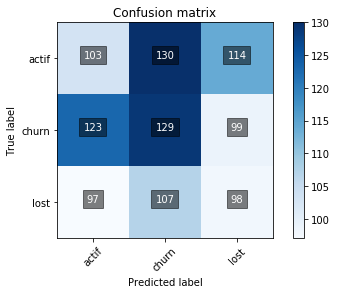

### Motivation

**Clarity:** Confusion matrices give quickly a good idea of the classification quality

### I. The function


```python
import matplotlib.pyplot as plt
import itertools
import numpy as np

def plot_confusion_matrix(confusion_matrix, classes, y_label, x_label, title='Confusion matrix', cmap=plt.cm.Blues):
    """
    This function plots the confusion matrix

    :param confusion_matrix: The matrix containing the data to plot
    :param classes: The different classes of our classification problem
    :param y_label: label of the y_axis in the plot
    :param x_label: label of the x_axis in the plot
    :param title: Title of the graph
    :param cmap: color map reference

    :return: Plots the confusion matrix
    """
    plt.figure()

    plt.imshow(confusion_matrix, interpolation='nearest', cmap=cmap)
    plt.title(title)
    plt.colorbar()
    tick_marks = np.arange(len(classes))
    plt.xticks(tick_marks, classes, rotation=45)
    plt.yticks(tick_marks, classes)
    fmt = 'd'

    for i, j in itertools.product(range(confusion_matrix.shape[0]), range(confusion_matrix.shape[1])):
        plt.text(j, i, format(confusion_matrix[i, j], fmt),
                 horizontalalignment='center',
                 color='white',
                 bbox={'facecolor': 'black', 'alpha': 0.5, 'pad': 4})

    plt.tight_layout()
    plt.ylabel(y_label)
    plt.xlabel(x_label)
    plt.show()

```
### II. The results

- Dataset generation

**Classification problem:** We need to predict the driver status between 3 classes Actif/Churn/Lost

**Dataset Generation:** We generate randomly 2 lists representing the predictions and the true labels of our situaion


```python
import pandas as pd
from random import randint, sample
```

```python
y_pred = [randint(0, 2) for i in range(1000)]
y_true = [randint(0, 2) for i in range(1000)]

di = {0: 'actif', 1: 'churn', 2: 'lost'}
y_pred = [di.get(n,n) for n in y_pred]
y_true = [di.get(n,n) for n in y_true]
```
- Plot the matrix


```python
from sklearn.metrics import confusion_matrix
%matplotlib inline
```

```python
# Function inputs
classes = ['actif', 'churn', 'lost']
conf_matrix = confusion_matrix(y_true, y_pred)

# Plot the matrix
plot_confusion_matrix(conf_matrix, classes, 'True label', 'Predicted label', title='Confusion matrix', cmap=plt.cm.Blues)
```



